# Enhancing Shopify with Real-Time Recommendations Using Nussknacker and Machine Learning

## Overview: Bridging Data Streams and E-commerce

In today’s fast-paced world of online shopping, providing customers with a personalized experience isn't just a
bonus—it's essential. Customers expect suggestions tailored to their interests and browsing behavior. While modern
recommendation systems leverage vast datasets to predict preferences, seamlessly integrating these systems into existing
platforms poses challenges. Businesses need real-time data processing and scalable machine learning solutions to meet
these demands.

In this article, we demonstrate how **Nussknacker (Nu)**, paired with **Snowplow**, a popular open-source event tracking
system, can transform raw event data into actionable insights. Using Shopify as an example, we showcase how Nu processes
click streams and app events in real time. With **Nu MLflow** component, pre-trained machine learning models can be
effortlessly integrated into the streaming process, enabling businesses to deploy custom models for dynamic,
personalized recommendations instantly.

By combining real-time data streams with advanced machine learning, Nu helps businesses exceed customer expectations,
driving engagement and boosting sales. Nu Designer simplifies complex data processes, making it accessible even for
teams without coding expertise or/and without deep knowledge of streaming and Flink. As we delve into this use case,
we’ll explore how **Nu**, **Snowplow**, and custom machine learning models come together to elevate e-commerce
personalization.

## Use Case: Real-Time Recommendations

We aim to deliver real-time personalized product recommendations in Shopify by following these steps:

- **Capture User Interactions:** Use the Snowplow tracker to collect clickstream data from the Shopify store and send it
  to the Nu Cloud HTTP endpoint for processing.
- **Process Events:** Parse incoming event data in Nussknacker, group products viewed by users within a specific time
  window, and prepare data for ML model input.
- **Generate Recommendations:** Utilize the MLflow component in Nussknacker to feed grouped product data into a machine
  learning model for real-time recommendations.
- **Send Recommendations to Shopify:** Use the Nu HTTP component to update Shopify's backend with personalized
  recommendations via the Shopify API.
- **Display Recommendations:** Leverage the Shopify Storefront API and custom JavaScript in Liquid templates to fetch
  and render recommendations directly on product pages.

This use case demonstrates how Nussknacker efficiently handles real-time event data, integrates user-supplied machine
learning models, and enhances e-commerce platforms like Shopify with personalized recommendations. With this overview in
mind, let's delve deeper into each step to see how we can implement this solution.


> **_NOTE:_** This blog post is designed to be both an informative guide and a hands-on tutorial. Readers can either:
>
> - Follow along to understand the use case conceptually, or
> - Recreate the entire scenario step by step using the instructions provided in the collapsed sections.
>
> For those interested in replicating the solution, detailed step-by-step instructions have been included in expandable
> sections. These cover everything from setting up the environment to configuring Nussknacker scenario. To recreate this
> use case, you'll need a [Nu Cloud](https://nussknacker.io/nu-cloud/) instance. You can sign up for a free 3-month
> trial (no credit card required). This trial provides the necessary environment to implement and test the solution
> described in this post.

### Capturing Shopify Events with Snowplow

To kickstart our real-time recommendation system, we establish a reliable flow of user interaction data from our Shopify
store to Nussknacker using Snowplow.. Snowplow is a well-known solution for capturing user interactions, offering
open-source trackers that we can easily leverage. We use newly created Shopify store. Then we configure an HTTP endpoint
in our Nu Cloud instance to receive events directly from the Snowplow tracker integrated into our store. This setup
allows us to capture detailed user behavior in real time, providing the critical data needed to power our recommendation
engine.

<details>
   <summary>Expand for detailed instructions on how to do this</summary>

**Preparing the Shopify Store**

First, we create a Shopify store by signing up for [a free trial](https://www.shopify.com/free-trial) on their website.
It's essential to make the store publicly accessible so we can interact with it as customers do. This involves adjusting
the store's settings to
[remove password protection](https://community.shopify.com/c/shopify-discussions/how-do-i-make-my-online-store-visible-to-everyone/m-p/1955697#M343186),
allowing anyone to view the storefront.


**Setting Up the Nu Cloud Instance**

Next, we access our [Nu Cloud instance](https://manage.staging-cloud.nussknacker.io/tenants) and configure the settings
to allow incoming events from the Snowplow tracker. After signing in to our Nu Cloud, we click the right-top corner
**"Admin"** button to go to the instances list and we stop our instance to make the necessary changes (in the instance
Settings):

- We disable authorization by checking the **"No authorization"** option. Since the Snowplow tracker sends events
  directly from the browser, standard authentication isn’t suitable.
- We set the trusted domain to the address of our Shopify store. This ensures that only events from our store are
  accepted.

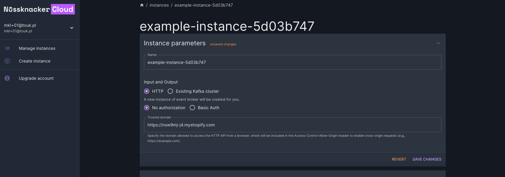

After saving the changes, we restart the instance to apply the new settings.

**Creating the Nu HTTP Endpoint**

With the instance configured, we proceed to create an HTTP endpoint that will receive events from the Snowplow tracker.
We click **"Open Instance"** button and then navigate to the topics list and add a new topic named **"shopify-events"**.
We select **"JSON"** as the content type to match the data format sent by Snowplow.


Once the topic is created, we copy the provided endpoint URL. This URL will be used to configure the Snowplow tracker in
our Shopify store.

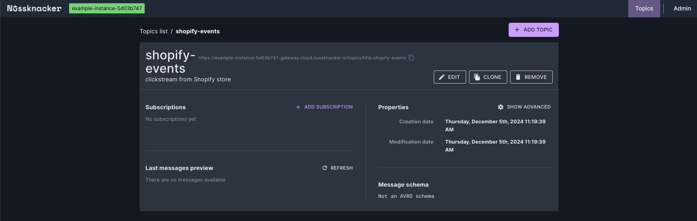

**Configuring the Snowplow Tracker in Shopify**

Back in Shopify, we install the [Snowplow Event Tracker](https://apps.shopify.com/snowplow-by-snowcatcloud) app from the
Shopify App Store. After installation, we access the app through the **"Apps"** section in the Shopify admin console. In
the frontend settings of the app, we activate the tracker and input the necessary configuration:

- We paste the Nu Cloud endpoint URL into the **"Snowplow Collector"** field.
- We enter an App ID, such as **"shopify-nu-recommendations"**, to identify our application.

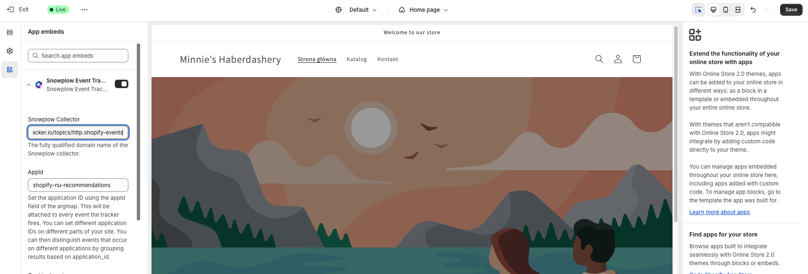

After saving the settings, the Snowplow tracker begins sending events from our Shopify store to the Nu Cloud endpoint.

**Verifying Events Flow**

To ensure everything is working correctly, we navigate through our Shopify store as a visitor would. Even if we haven't
added any products yet and the store is empty, we can still generate events by interacting with the site. We click on
the catalog, navigate to existing pages, and explore different sections of the store. These actions will trigger
Snowplow events.

After interacting with the store, we return to the Nu Cloud instance topics list and check the **"shopify-events"**
topic we created earlier. In the **"Last Messages Preview"** section, we should see the events we've just generated.

</details>
</br>


### Stream Processing Made Easy with Nussknacker

With our Shopify store sending events to Nu Cloud via Snowplow, we're ready to harness Nussknacker’s capabilities to
process these events. The events collected by the HTTP endpoint are stored in Kafka, which serves as the source for our
Nussknacker scenario. Although we don't utilize predefined Snowplow event schemas, Nussknacker's flexible JSON parsing
allows us to handle the incoming data effectively. We leverage standard Nussknacker components like **Filter** and
**Variable** to parse and validate the events, extracting essential information such as user identifiers, viewed
products, and timestamps. In addition, we include a debugging sink, which in our user case is one of several Nussknacker
methods, to monitor and ensure that our and ensure that our scenario is working correctly.

This data processing setup ensures that only relevant data is passed to our machine learning model, laying the
groundwork for generating accurate and personalized recommendations.

<details>
   <summary>Expand for detailed instructions on how to do this</summary>

**Setting Up the Scenario**

On the scenario list page, we click the **"Add New Scenario"** button to create a new streaming scenario. In the dialog
that appears, we select **"Streaming"** as the processing mode and name the scenario
**"shopify-realtime-recommendations"**. After clicking **"Create"**, we're taken to the scenario editor.

In the scenario editor, we see an empty canvas where we’ll design our data processing algorithm. From the **Creator
Panel** on the left, we drag and drop the **kafka** source component onto the canvas. We use it because the events
collected by the previously created HTTP endpoint are stored in Kafka topics within Nu Cloud. And thanks to this, we can
retrieve these events directly from Kafka and process them in our scenario. This setup allows us to efficiently handle
the incoming events from our Shopify store in real time.

We double-click on the source node to configure it. In the properties window, we:

- **Name:** Change it to **"Shopify Snowplow Events"** for clarity.
- **Topic:** Select **"http.shopify-events"** from the Topic dropdown, which is the topic where Snowplow events are
  collected. _(We created this topic in the previous section)_
- **Content-Type:** Set it to **"JSON"** to match the format of the incoming data.

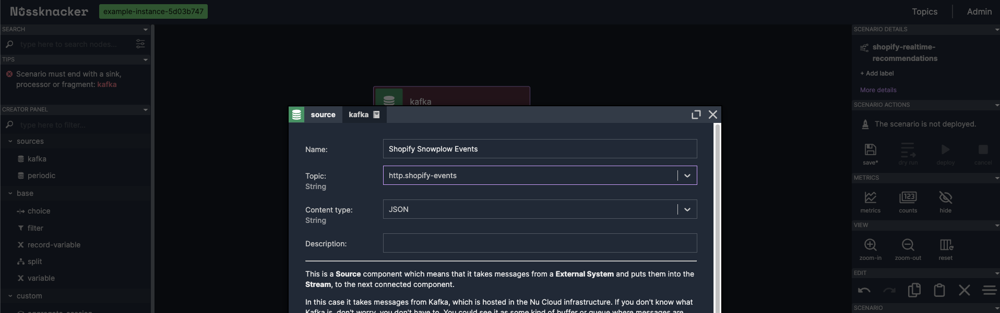

After applying these settings, we save our scenario.

**Adding a Sink Component for Debugging**

To verify that events are flowing correctly, we add a sink component that writes the incoming events to a new topic for
inspection. Follow the instructions from the previous section to create a new topic, named
**"shopify-found-recommendations"** with **"JSON"** as the content type.

_Note: Refer back to the earlier instructions if you need a refresher on creating topics._

Returning to the scenario editor, we drag the **"Kafka"** sink component onto the canvas and place it below our source
node. We we connect the source node to the sink node by drawing a connector between them. Then we double-click the sink
node to configure it:

- **Name:** **"Log Recommendations"**
- **Topic:** Select **"http.shopify-found-recommendations"** from the Topic dropdown.
- **Value:** Enter `#input` to pass the incoming data directly to the sink.


After applying these settings, we save our scenario.

**Visualizing the Scenario**

Before we proceed, it's helpful to see the overall scenario we've built so far.


**Deploying and Testing the Scenario**

With our scenario set up, we save and deploy it by clicking the "Deploy" button in the right panel of the scenario
editor. After a while the scenario should be in the running state. To verify that everything is working correctly, we
perform the following steps:

1.  **Generating Events:** Before generating events, it’s important to have some example products in your Shopify store.
    If you haven’t added any products yet, please do so now. Once you have added some products, navigate to your Shopify
    store as a visitor would. Click on various product pages, add items to the cart, and explore different sections of
    the store. These interactions will generate events that our scenario can process, including product view events that
    are essential for testing our data extraction logic.

2.  **Monitoring Event Flow with Counts:** Back in the scenario editor, we click on **"Counts"** in the **"Metrics"**
    section on the right-hand side menu. We enable auto-refresh by clicking on **"No Refresh"**, which changes to
    **"Auto-refresh in 10 seconds"**. We select **"Latest Deploy"** from the **"Quick Ranges"** options to view the most
    recent data.

    

    As we interact with the store, we observe the numbers on each node increasing, indicating that events are flowing
    through the scenario. This real-time feedback confirms that our scenario is receiving and processing events as
    expected.

3.  **Inspecting the Output Topic:** We navigate to the Topics list in Nussknacker and select the
    **"shopify-found-recommendations"** topic. In the **"Last Messages Preview"** section, we can see the messages that
    have been processed by our scenario. These messages should include the data extracted from the events, such as the
    user ID, product slugs, and timestamps.

By following these steps, we confirm that our scenario is correctly processing events from our Shopify store, including
the product view events necessary for generating personalized recommendations.

**Extracting Relevant Data**

Our goal is to extract specific data needed for our machine learning model:

- **User Identifier**
- **Viewed Product Identifiers**
- **View Timestamps**

Since our clickstream contains many events, we'll filter out the unnecessary ones and extract the required information
from the relevant events. Without a predefined JSON schema, we'll manually parse the JSON data using Nussknacker's
expression language (which is [SpEL](https://nussknacker.io/documentation/docs/next/scenarios_authoring/Spel/)). We'll
use **"Variable"** and **"Filter"** nodes together, where each filter validates the variable extracted.

**Building the Data Extraction Logic with Nussknacker**

To prepare our data for the machine learning model, we’ll implement the data extraction logic. This will be achieved by
a sequence of processing steps (nodes in the Nu scenario). Each step involves extracting and validating essential
information from the incoming events, ensuring that only relevant data moves forward in our scenario. By the end of this
section, we’ll have a robust data extraction pipeline that feeds clean, structured data into our model. Let’s dive into
the steps involved:

1. **Extracting and Validating the Message Schema**

   We add a **"Variable"** node after the source node to extract the message schema:

   - **Name:** "Extract Message Schema"
   - **Variable Name:** `messageSchema`
   - **Expression:** `#input["message"]["schema"].toString()`

   Immediately after, we add a **"Filter"** node to validate the schema:

   - **Name:** "Validate Message Schema"
   - **Expression:** `#messageSchema == "iglu:com.snowplowanalytics.snowplow/payload_data/jsonschema/1-0-4"`

   This ensures only events with the correct schema proceed further.

   

2. **Extracting and Validating the Viewed Product Event**

   Next, we add another **"Variable"** node to extract the page view event:

   - **Name:** "Extract Viewed Product Event"
   - **Variable Name:** `viewedProductEvent`
   - **Expression:** `#input["message"]["data"].^[#this["e"] == "pv"]`

   We follow this with a **"Filter"** node:

   - **Name:** "Validate Viewed Product Event"
   - **Expression:** `#viewedProductEvent != null`

   This extracts the page view event JSON object and ensures it exists.

   

3. **Extracting and Validating the App ID**

   We add a **"Variable"** node to extract the App ID:

   - **Name:** "Extract App ID"
   - **Variable Name:** `snowplowTrackerAppId`
   - **Expression:** `#viewedProductEvent["aid"]?.toString()`

   Followed by a **"Filter"** node to validate it:

   - **Name:** "Validate App ID"
   - **Expression:** `#snowplowTrackerAppId == "shopify-nu-recommendations"`

   This ensures the event originates from our Snowplow tracker.

   

4. **Extracting the Anonymous User ID**

   We add another **"Variable"** node:

   - **Name:** "Extract Anonymous User ID"
   - **Variable Name:** `anonymousUserId`
   - **Expression:** `#viewedProductEvent["duid"]?.toString()`

   This extracts the user identifier for personalization.

5. **Extracting and Validating Product Details**

   We use a **"Record Variable"** node to extract the product identifier and view timestamp. Since there is no better
   candidate for identifying a product, we will use its slug as the product’s identifier.

   - **Name:** "Extract Product Details"
   - **Variable Name:** `product`
   - **Fields:**

     - **slug** with **Expression:**

       ```spel
       #viewedProductEvent["url"]?.toString()?.startsWith("https://your-store.myshopify.com/products/")
         ? #viewedProductEvent["url"]?.toString()?.substring("https://your-store.myshopify.com/products/".length())
         : null
       ```

       _Note: Replace `https://your-store.myshopify.com` with your actual store URL._

     - **viewTimestamp** with **Expression:** `#viewedProductEvent["dtm"]?.toLong()`

   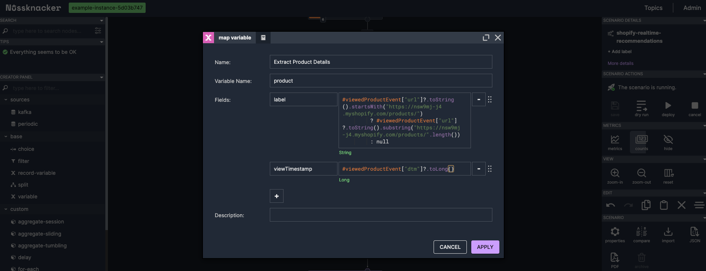

   We then add a **"Filter"** node to validate the extracted data:

   - **Name:** "Validate Product Details"
   - **Expression:** `#anonymousUserId != null && #product.slug != null && #product.viewTimestamp != null`

6. **Updating the Sink to Output Extracted Data**

   We double-click the sink node to edit it:

   - **Value:** Enter:

     ```spel
     {
       "userId": #anonymousUserId,
       "product": #product
     }
     ```

   This ensures the sink outputs only the relevant data.

   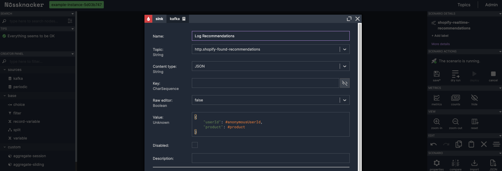

**Deploying and Testing the Enhanced Scenario**

After implementing the data extraction logic, we save and redeploy the scenario by clicking the "Deploy" button. To test
our enhancements, we repeat the testing procedure outlined in the **Deploying and Testing the Scenario** section. By
revisiting the testing steps, we ensure that our enhancements are functioning as intended and that the scenario
continues to process events correctly.

</details>

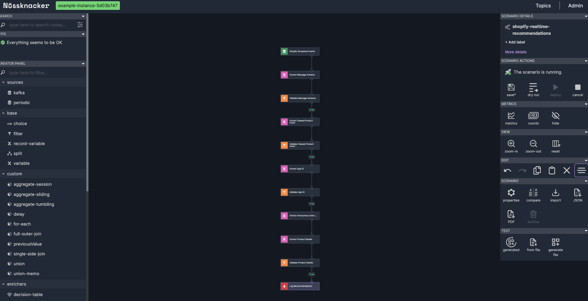

### Incorporating Machine Learning for Dynamic Recommendations

Personalized product recommendations based on the products a user has viewed require a robust machine learning learning
model capable of capturing both short-term and long-term user preferences. We find **SLi-Rec**
([Short-term and Long-term preference Integrated RECommender system](https://www.microsoft.com/en-us/research/uploads/prod/2019/07/IJCAI19-ready_v1.pdf)),
a deep learning-based framework designed to enhance personalized recommendations by modeling users' sequential behavior.
SLi-Rec uses self-attention mechanisms to effectively capture both long-term and short-term user preferences.

**Key Features of SLi-Rec:**

- **Self-Attention Mechanism:** Identifies relationships between items in a user's interaction sequence, enhancing the
  representation of user preferences.
- **Fusion of Long- and Short-Term Interests:** Balances immediate trends with established patterns for better
  recommendation accuracy.
- **Efficient Sequential Modeling:** Processes user interaction sequences dynamically, improving predictions for the
  next item of interest.

In the realm of recommender systems, two paradigms are most popular today: **general recommenders** and **sequential
recommenders**.

**General recommenders**, such as factorization-based collaborative filtering methods, aim to learn users' long-term
preferences, which are presumed to be static or change slowly over time. While these systems can provide decent
recommendations, they often fail to reflect users' recent behaviors. They also require periodic retraining on collected
historical data to account for any changes in users' preferences.

**Sequential recommenders**, on the other hand, strive to capture the variability of user behaviors influenced by
evolving interests, demands, or global trends. These recommenders operate on sequences of user actions, meaning any
changes in preferences and the order of those actions both influence the provided recommendations. This attention to
both short-term and long-term interests makes sequential recommenders superior in use cases requiring real-time product
recommendations.

Given our goal of delivering real-time, personalized recommendations in our Shopify store, SLi-Rec's ability to
integrate both short-term and long-term user interests makes it an ideal choice. By leveraging SLi-Rec within our
Nussknacker scenario, we can dynamically respond to users' immediate behaviors while also considering their historical
preferences, thereby enhancing the overall shopping experience.

### A Word About ML In Nu

To integrate our machine learning model into the Nussknacker processing pipeline, we utilize Nussknacker's support for
model inference through its **MLflow** component. This feature allows us to incorporate machine learning models directly
into our streaming data flows, enabling real-time predictions.

Using the MLflow component, we select a specific model from the **MLflow Model Registry**. The MLflow Model Registry is
a centralized repository that manages the lifecycle of ML models, providing versioning and easy deployment options.
Within Nussknacker, we assign the required input parameters to the model, aligning it with the data we've extracted from
our events.

During the scenario deployment to the **Flink** runtime environment, Nussknacker retrieves the selected model from the
registry and deploys it within the **Nussknacker ML runtime**, a distributed execution environment optimized for
Python-based machine learning tasks. This specialized runtime ensures models developed in Python integrate smoothly,
providing both performance and scalability for continuous inference when using the model in stream processing.

The Flink job, orchestrated by Nussknacker Designer, communicates directly with the deployed model in the ML runtime to
perform inference. With this setup, our streaming application delivers real-time predictions based on incoming data,
maintaining low latency and enabling rapid, data-driven decision-making.

By leveraging Nussknacker's MLflow component, we effectively bring our machine learning models into the streaming
context, allowing us to provide dynamic, personalized recommendations to users as they interact with our Shopify store.

For a deeper dive into how this process works, you can read
[Łukasz Jędrzejewski’s blog post](https://nussknacker.io/blog/ml-models-inference-in-fraud-detection/). In the section
**"MLflow model inference simplified with Nussknacker ML runtime"**, he explains the integration in detail, showcasing
how Nussknacker simplifies model inference in streaming applications.

### Preparing and Registering the Recommendation Model

To utilize our selected recommendation model within Nussknacker, we first need to train it with the relevant data. We’ve
provided a comprehensive Jupyter notebook and detailed instructions to guide you through setting up your environment on
Azure Databricks, training the model, and registering it in MLflow. Once the model is trained and registered, it’s ready
to be integrated into our Nussknacker scenario. This integration enables us to turn aggregated user interactions into
real-time personalized product recommendations, leveraging the power of machine learning.

<details>
   <summary>Expand for detailed instructions on how to do this</summary>

**Setting Up Azure Databricks**

Before diving into the notebook, we need to set up the environment where we’ll train the recommendations model. This
guide walks you through the necessary steps to prepare Azure Databricks for seamless execution of the notebook.

For this task, we’ll use **Databricks**, a popular platform for collaborative data science and machine learning.
Specifically, we’ll leverage Databricks on the Azure cloud to efficiently build, train, and deploy our model. If you
don’t already have an Azure subscription, you can sign up for a free trial at the
[Azure Portal](https://portal.azure.com/).

> **_NOTE:_** If you already have an Azure Databricks account, you can go to the "Installing Required Libraries"
> subsection

By the end of this section, you’ll have a fully configured Azure Databricks environment, ready to run the notebook and
train the recommendations model.

**Create a Resource Group**

We start by setting up our environment on Azure by creating a resource group:

- Log in to the [Azure Portal](https://portal.azure.com/) and navigate to **Resource Groups**.
- Click the **"Create"** button to create a new resource group.
- Select your subscription, provide a name for the resource group, and choose a region that suits you.
- Click **"Review + Create"**, and once validation passes, click **"Create"** to finalize the setup.


**Creating a Databricks Workspace**

Next, we create a Databricks workspace within the resource group:

- Navigate to **Azure Databricks** services in the Azure Portal.
- Click **"Create"** to set up a new Databricks workspace.
- Choose your subscription and the resource group you just created.
- Provide a name for your workspace and select the same region as before.
- Click **"Review + Create"**, and after validation, click **"Create"**.
- Wait for the deployment to complete. This may take a few minutes.
- Once finished, click **"Go to resource"** to access your new Databricks workspace.


**Creating a Compute Cluster**

We have to create a compute cluster to run our notebook and train the model:

- In the Databricks workspace, click on **"Compute"** in the left-hand menu.
- Click **"Create Cluster"**.
- Configure the cluster settings:

  - **Cluster Mode:** Select **"Single Node"**.
  - **Databricks Runtime Version:** Choose **"14.3 LTS"** or a version that supports Python 3.10.

- Leave other settings at their default values.
- Click **"Create Cluster"**. The cluster creation process may take a few minutes.

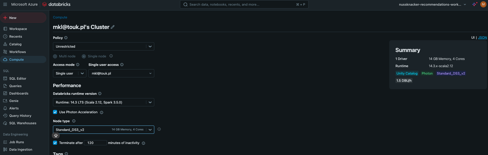

**Installing Required Libraries**

With the cluster created, we need to install the necessary Python libraries:

- Click **"Launch Workspace"** to open the Databricks workspace in a new tab.
- In the **"Compute"** section, click on your newly created cluster.
- Navigate to the **"Libraries"** tab.
- Click **"Install New"**.
- In the **"Install Library"** dialog:

  - **Library Source:** Select **"PyPI"**.
  - **Package:** Enter the library name and version.

- Using the method mentioned above, install the following libraries one by one:

  - `mlflow-skinny[databricks]`
  - `mlflow==2.18.0`
  - `recommenders==1.2.0`
  - `tensorflow==2.12.1`

- Wait for all libraries to be installed successfully before proceeding.


**Importing the Python Notebook**

Now, we import our prepared Jupyter notebook into the Databricks workspace:

- In the left-hand menu, click on **"Workspace"**.
- Click the **"Create"** button and select **"Git Folder"**.
- Enter the Git repository URL: https://github.com/TouK/recommendations-showcase
- Click **"Create"** to clone the repository into your workspace.
- You should now see the notebook **"recommendations_model_training"** in the **"model-training"** folder of your
  workspace.

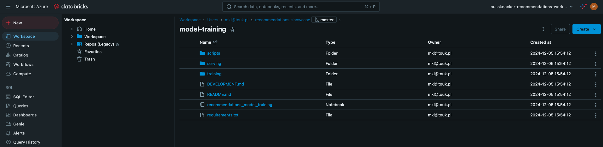

**Creating a Shopify Token**

Our notebook requires access to your Shopify store to fetch data and interact with products. We create a private app to
generate an API token:

- In your store Settings (find the **"Settings" button in the left-bottom of Shopify admin panel), navigate to **"Apps
  and sales channels"\*\*.
- Click on **"Develop apps"**.
- Click **"Create an app"**.
- Provide an app name (e.g., **"nussknacker_ml_notebook"**) and click **"Create app"**.
- In the app settings, go to the **"Configuration"** tab.
- Click **"Configure"** in **"Admin API integration"** section, and select the necessary permissions:

  - `write_product_listings`
  - `read_product_listings`
  - `write_products`
  - `read_products`
  - `write_publications`
  - `read_publications`

- Click **"Save"** to apply the permissions.
- Navigate to the **"API Credentials"** tab.
- In the **"Access tokens"** section, click **"Install app"**.
- Confirm the installation, and Shopify will generate an access token.
- **Copy the token** and store it securely, as it will be needed in the notebook.


**Running the Notebook**

Now we're ready to run the notebook and train our model:

- In the Databricks workspace, navigate to the imported notebook **recommendations_model_training.ipynb** in the
  `model-training` directory.
- Attach the notebook to your compute cluster by selecting the cluster from the dropdown menu at the top of the
  notebook.
- Follow the instructions within the notebook, executing each cell in order.
- In the first step of the notebook, you have three options for data sources:

  - **Option 1:** Generate synthetic data if your Shopify store doesn't have products.
  - **Option 2:** Use your own data.
  - **Option 3:** Use an existing dataset.

- If you've just created the Shopify store and have no products or limited data, **Option 1** is recommended.
- Proceed through the notebook, ensuring you input any required parameters, such as the Shopify token and Databricks
  credentials you obtained earlier.


> **_NOTE:_** The model training process may take approximately **30 minutes**. Be patient and ensure that your cluster
> remains active during this time.

**Exposing Databricks MLflow Registry**

To allow Nussknacker to communicate with the Databricks MLflow Model Registry, we need to expose it externally:

1. Note the Workspace URL

- In the **Overview** section of your Databricks workspace, note down the **URL** provided. We'll need this later for
  configuring Nussknacker.

  

1. Set Up Service Principals and Secrets

To securely connect Nussknacker with the Databricks MLflow Registry:

- In the Databricks workspace, click on your user icon in the top-right corner and select **Settings"**.

  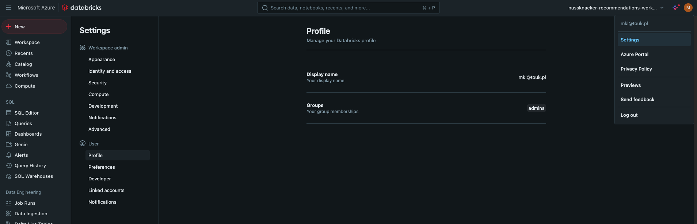

- Navigate to **"Identity and access"**.
- Click **"Manage"** button in the **"Service principals"** section
- Click **"Generate New Token"**.
- Click **"Add Service Principal"** and **"Add new"** in the modal window
- Choose **"Databricks Managed"**, provide a name (e.g., **"nu-cloud"**), and click **"Add"**.
- Click on the newly created service principal's name.
- Pick **"Allow cluster creation"** option and click **"Update"**.
- Navigate to the **"Secrets"** tab and click **"Generate New Secret"**.
- Copy both the "Client ID" and "Secret" values\*\* and store them securely.

  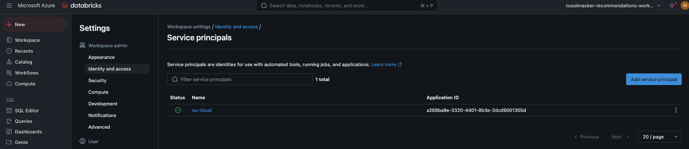

1. Share the **"recommendations-showcase"** Repository

- Navigate to **"Workspace"** in the left-hand menu, select **"Home"**, and locate the **"recommendations-showcase"**
  repository.
- Click the **Share** button in the top-left corner of the repository page.
- In the **"Type to add multiple users, groups or service principal"** field, enter the service principal name
  **"nu-cloud"** that you created earlier.
- Set the permission level to **"Can View"**, then click the **"Add"** button.
- Close the sharing modal to finalize the changes.

  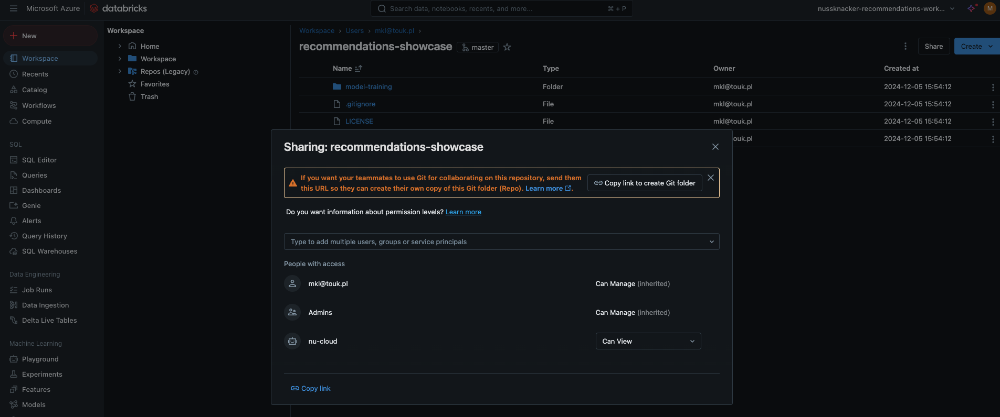

1. Grant Read Permission for the Trained and Published Model

- In the left-hand menu, navigate to **"Models"** under the **"Machine Learning"** section. You should see the
  **"slirec_shopify_model"** listed.
- Click the **"Permissions"** button in the top-right corner of the model's page.
- In the **"Select user, group, and service principal..."** field, enter **"nu-cloud"**.
- Set the permission level to **"Can Read"**, then click **"Add"**.
- Save your changes by clicking the **"Save"** button.

  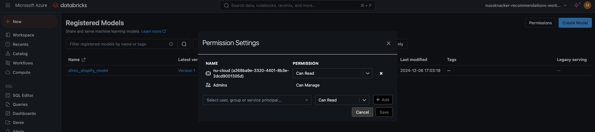

The model registry is now accessible for read operations from outside the Azure Databricks platform.

</details>
</br>

### Using Nu ML Component in Real-Time Data Processing

With the trained model prepared, we focus on embedding it into our Nussknacker scenario. The integration involves
combining real-time data aggregation with machine learning inference to create a dynamic and responsive system.

First, we group product interactions for each user using Nussknacker’s **Sliding Window** aggregation component. This
step collects product views of a single user over a defined time period (e.g., five minutes) and organizes them into
structured data, including product slugs and timestamps. These aggregated events represent the user’s recent
interactions, which serve as the input for the recommendation model.

Next, we integrate the machine learning model using the **MLflow** component. This allows us to seamlessly connect to
the model hosted in the MLflow registry (in our case, Azure Databricks) and utilize the model's signature to correctly
assign the aggregated data variables as inputs. During runtime, the model processes this input to generate personalized
product recommendations in real time.

This powerful setup demonstrates how Nussknacker simplifies the integration of machine learning models into streaming
data processes, enabling us to deliver a more engaging shopping experience to our customers. In the next step, we’ll
bring these recommendations full circle by sending them back to Shopify for display, completing the loop from data
collection to customer engagement.

<details>
   <summary>Expand for detailed instructions on how to do this</summary>

**Enable the Nu ML integration**

First, we need to enable the MLflow component within Nussknacker to connect with our model hosted on Azure Databricks.
This involves updating our instance settings to establish a secure connection.

First, please stop the scenario by clicking the **"Cancel"** button in the right-hand menu to stop our scenario. then we
click on the **"Admin"** button located in the top-right corner. To apply new configurations,it's necessary to stop the
instance temporarily. We do this by clicking the **"Stop"** button and wait until the instance status changes to
**"Stopped"**.

Once the instance is stopped, we access the instance settings by clicking on **"Settings"**. In the **"Manage Instance
Enrichers"** section, we find the **"MLflow"** card. Clicking on it opens a form where we need to input the details to
connect to our MLflow server.

We fill in the following information:

- **Name:** We enter **"azuredatabricks"** as the identifier for our ML component within Nussknacker (you )
- **Server URL:** This is the URL from the **"Overview"** section of our Azure Databricks Service—the workspace URL we
  noted earlier.
- **Token URL:** We append `/oidc/v1/token` to the Server URL, forming the complete Token URL needed for authentication.
- **Client ID:** This is the **"Client ID"** saved when we created the Service Principal in Azure.
- **Client Secret:** This is the **"Secret"** saved when we created the Service Principal in Azure.
- **Scope:** We set this to **"all-apis"**.


After entering all the details, we click **"Save changes"** to apply the configuration. Returning to the instances list,
we restart the instance by clicking **"Start"**. Once the instance is running, we reopen our scenario editor.

In the **"Creator Panel"** on the left, under the **"Enrichers"** section, we confirm that the
**"azuredatabricks-mlflow"** component is now available (you may need to refresh the page). This component allows us to
integrate our model into the data processing flow.

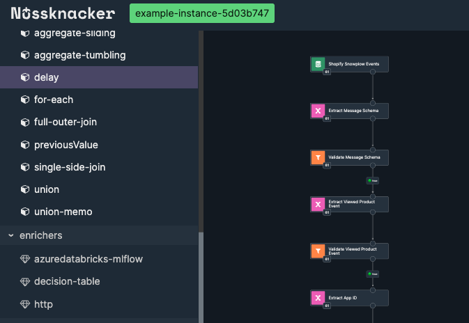

**Aggregating User Interactions**

Our model requires specific inputs: the user ID, a list of viewed product slugs, and corresponding timestamps. Since
each Snowplow event represents a single product view, we need to collect multiple events for each user over a period.

To achieve this, we use Nussknacker's **"Sliding Window"** aggregate component. This allows us to collect and aggregate
data over a defined time window. We locate the **"sliding-window"** component in the **"Custom"** section of the Creator
Panel. We drag it into the scenario, placing it between the **"Validate Product Details"** node and the **"Log
Recommendations"** sink node.

Double-clicking the sliding window node opens its properties. We give it a descriptive name, such as **"Aggregate
Products for a Given User"**, and set the **Output Variable Name** to `aggregatedProducts`.

To group events by user, we set the **Group By** field to `#anonymousUserId`. This ensures that we aggregate events
separately for each user.

In the **"Aggregations"** section, we define two aggregations:

- **First Aggregation (Product Slugs):**
  - **Output Field:** `slugs`
  - **Aggregator Type:** `List`
  - **Aggregator Input:** `#product.slug`
- **Second Aggregation (View Timestamps):**
  - **Output Field:** `viewTimestamps`
  - **Aggregator Type:** `List`
  - **Aggregator Input:** `#product.viewTimestamp`

We set the **"Window Length"** to **5 minutes**, meaning the aggregation considers events from the last five minutes for
each user. For each processed event, it produces an updated list of the user's viewed product slugs and their
corresponding view timestamps.

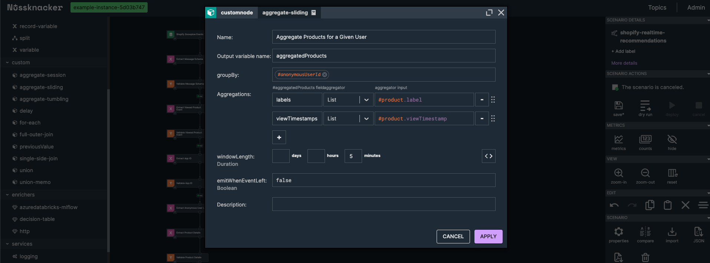

After applying these settings, our scenario now collects and aggregates user interactions over a five-minute window,
preparing the data needed for the model.

**Integrating the ML Model**

With the aggregated data ready, we proceed to integrate our machine learning model into the scenario.

From the **"Enrichers"** section in the Creator Panel, we drag the **"azuredatabricks-mlflow"** component into the
scenario, placing it after the previously created aggregation node.

Opening its properties, we give it a meaningful name, such as **"Infer Recommendations"**. We select our model
**"slirec_shopify_model"** from the **"Model"** dropdown and choose the latest version available.

The component then displays fields for the model's input parameters:

- **userId:** We enter `#anonymousUserId` to pass the user's ID.
- **items:** We enter `#aggregatedProducts.slugs` to provide the list of viewed product slugs.
- **timestamps:** We enter `#aggregatedProducts.viewTimestamps.![#this.toString()]` to pass the list of timestamps,
  converting each timestamp to a string as required by the model.

We set the **"Output Variable Name"** to `recommendationsModelOutput`, which will store the model's output.


After applying these settings, our model is now integrated into the scenario and ready to generate recommendations based
on the aggregated user interactions.

**Updating the Sink Node**

To verify that the model is working correctly, we update the sink node to include the model's output in the data we
write to the topic.

We open the **"Log Recommendations"** sink node and modify the **"Value"** field to:

```spel
{
    "userId": #anonymousUserId,
    "product": #product,
    "aggregatedProducts": #aggregatedProducts,
    "recommendationsOutput": #recommendationsModelOutput
}
```

This structure includes both the user ID, currently viewed product, aggregated products in 5 minutes windows and the
recommendations model output.

**Deploying and Testing the Scenario**

With all components in place—including the MLflow component and the sliding window aggregation—we save the scenario and
deploy it by clicking the **Deploy** button. After confirming the deployment, the scenario is up and running.

To test our enhancements, we once again follow the testing procedure outlined in the **Deploying and Testing the
Scenario** section. However, this time, we’re focusing on verifying that the model inference is working and that we
receive recommendations based on aggregated user interactions.

Using this method we confirm that the model inference works and that we receive recommendations for the aggregated
products for each user.

</details>
</br>


### Sending Recommendations Back to Shopify

With the machine learning model integrated into our Nussknacker scenario, we now turn our attention to sending
personalized recommendations back to Shopify. This step ensures that the insights generated by our scenario are made
accessible to users, enhancing their shopping experience.

Before sending the recommendations, we refine the model's output through a post-processing step. By limiting the number
of recommended products to a maximum of 10, we ensure the suggestions remain concise and relevant. This highlights
Nussknacker’s flexibility in adapting raw model inference results to meet specific business needs.

To handle the transmission of recommendations, we utilize Nussknacker's versatile HTTP component. This general-purpose
tool seamlessly integrates with Shopify’s Admin API, even though the API relies on GraphQL. The HTTP component provides
a straightforward and efficient way to communicate with Shopify’s backend, showcasing its adaptability for various
integration scenarios.

While the recommendations need to be stored for retrieval, the storage backend could be any database or system that fits
the business requirements. For this use case, we chose Shopify’s Metaobjects to simplify the setup. These Metaobjects
associate the recommended products with a user ID, making them easy to manage and retrieve. However, this approach could
be replaced with other storage solutions depending on the desired architecture.

With this we have successfully completed the technical flow: capturing user interactions, generating personalized
recommendations using a machine learning model, and sending them back to Shopify for storage. This integration
demonstrates the full potential of combining Nussknacker’s streaming capabilities with Shopify’s API to deliver
real-time personalization.

The next step is to make these recommendations visible to customers. In the upcoming section, we’ll focus on how to
display the recommendations within your Shopify store.

<details>
   <summary>Expand for detailed instructions on how to do this</summary>

**Post-Processing the Recommendations**

Before sending the recommendations, we need to perform a simple post-processing step. Often, the raw output from a model
isn't ready to be used directly and requires some adaptation. In our case, we decide to limit the number of
recommendations to a maximum of **10** products to keep the suggestions concise and relevant.

To implement this, we add a new **Variable** node to our scenario:

1. **Adding the Variable Node:**

   From the **Creator Panel**, we drag the **Variable** component into our scenario, placing it after the **"Infer
   Recommendations"** node.

2. **Configuring the Variable Node:**

   We double-click the variable node to open its properties.

   - **Name:** We enter **"Limit Recommendations"** to reflect its purpose.
   - **Variable Name:** `recommendationIds`
   - **Expression:** We use the following expression to limit the recommendations:

     ```spel
     #COLLECTION.take(#recommendationsModelOutput.itemIds, 10)
     ```

     This expression takes the first 10 items from the list of recommendations provided by the model.

   - We click **"Apply"** to save the changes.


**Preparing to Send Recommendations to Shopify**

With our curated list of recommendation IDs ready, the next step is to send these to Shopify so they can be displayed to
the user. We decide to use Shopify's
[Admin API](https://shopify.dev/docs/api/admin-graphql/2024-10/mutations/metaobjectUpsert) to store the recommendations
in a custom metaobject. Although the API uses GraphQL, Nussknacker's flexible HTTP component allows us to interact with
it seamlessly.

But before we start, let's:

**Create an API Token in Shopify**

To authenticate our requests, we need to create a private app in Shopify to generate an access token.

1. **Accessing Shopify Admin Console:**

   We log into our Shopify admin panel and navigate to **"Apps and sales channels"** from the left-hand menu.

2. **Creating a New App:**

   At the bottom of the page, we click on **"Develop apps"**. On the **"Develop apps"** page, we select **"Create an
   app"**.

3. **Configuring the App:**

   - **App Name:** We enter **"nussknacker_recommendations_scenario"**.
   - We click **"Create app"** to proceed.

4. **Setting API Permissions:**

   On the app's page, we navigate to the **"Configuration"** tab. Under **"Admin API integration"**, we click
   **"Configure"**. We select the following scopes: `write_metaobjects`, `read_metaobjects`. We then click **"Save"**.

5. **Installing the App and Retrieving the Token:**

   We move to the **"API credentials"** tab. In the **"Access tokens"** section, we click **"Install app"** and confirm
   the installation. Once installed, we click **"Reveal token once"**, copy the token, and save it securely for later
   use.

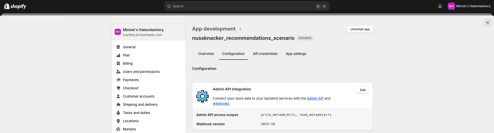

**Create a Metaobject in Shopify**

To store our recommendations, we need to define a metaobject in Shopify associated with each user.

1. **Navigating to Custom Data:**

   Back in the Shopify admin panel menu, we select **"Custom data"**.

2. **Adding a Metaobject Definition:**

   In the **"Define you first metaobjects"** section, we click on **"Add definition"**.

3. **Configuring the Metaobject Definition:**

   - **Name:** We enter **"nu_recommendation"**.
   - **Fields:**
     - We click **"Add field"**.
     - In the field creation form:
       - **Type:** We search for and select **"Product"**.
       - **Name:** We enter **"products"**.
       - **Configuration:** We choose **"List of products"**.
     - We click **"Add"** to add the field.
   - **Options:**

     - We enable **"Storefronts access"**.
     - We disable:
       - **"Active-draft status"**
       - **"Translations"**
       - **"Publish entries as web pages"**

   - We click **"Save"** to create the metaobject definition.


**Using the HTTP Component to call Shopify Admin API**

Assuming we have created the Shopify API token and the metaobject definition for storing recommendations, we're ready to
send the recommendations to Shopify using the HTTP component.

1. **Adding the HTTP Enricher Node:**

   From the **Creator Panel**, we locate the **http** enricher component. We drag it into the scenario, placing it after
   the **"Limit Recommendations"** variable node.

2. **Configuring the HTTP Node:**

   We open the HTTP node's properties:

   - **Name:** We enter **"Send Recommendations to Shopify"**.
   - **URL:** We set it to:

     ```
     {your-store-address}/admin/api/graphql.json
     ```

     _(Replace `{your-store-address}` with your actual Shopify store URL.)_

   - **HTTP Method:** We select **"POST"**.

   - **Headers:**

     We add a header:

     - **Name:** `X-Shopify-Access-Token`
     - **Value:** The access token we obtained from Shopify earlier.

     ```spel
     {
       {
         name: "X-Shopify-Access-Token",
         value: "shpat_a827..."
       }
     }
     ```

   - **Body:**

     We need to construct a GraphQL mutation to create or update the metaobject with the user's recommendations. We use
     the `#CONV.toJsonString` function to convert the list of recommendation IDs to a JSON string.

     **Expression:**

     ```spel
      {
        query: "mutation UpsertMetaobject($metaobject: MetaobjectUpsertInput!, $handle: MetaobjectHandleInput!) { metaobjectUpsert(handle: $handle, metaobject: $metaobject) { metaobject { id } userErrors { field message code } } }",
        variables: {
          handle: {
            handle: "customer-" + #anonymousUserId,
            type: "nu_recommendation"
          },
          metaobject: {
            fields: {
              {
                key: "products",
                value: #CONV.toJsonString(#recommendationIds)
              }
            }
          }
        }
      }
     ```

   - **Output Variable Name:** We set it to `sendRecommendationsResult`.

   - We click **"Apply"** to save the configuration.

   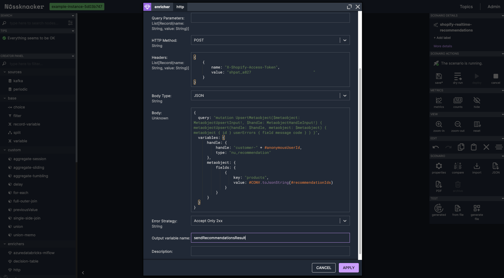

3. **Updating the Sink Node:**

   To verify that our recommendations are being sent correctly, we update the sink node.

   - We open the **"Log Recommendations"** sink node.
   - We modify the **"Value"** field to:

     ```spel
     {
        "userId": #anonymousUserId,
        "product": #product,
        "aggregatedProducts": #aggregatedProducts,
        "recommendationsOutput": #recommendationsModelOutput,
        "sendResult": #sendRecommendationsResult
     }
     ```

     This allows us to inspect the response from Shopify in our output.

   - We click **"Apply"** to save the changes.

**Deploying and Testing the Scenario**

With everything set up, we proceed to deploy and test our scenario. We save the scenario by clicking **"Save"**, and
then deploy it by clicking **"Deploy"**.

To test the scenario after integrating the recommendations back into Shopify, we follow the same testing procedure
outlined in the **Deploying and Testing the Scenario** section. However, this time, we focus on inspecting the
**sendResult** field in the **Last Messages Preview** of the "Log Recommendations" node. This field provides the
response from Shopify’s API, allowing us to verify that the recommendations are being sent successfully and the API is
processing the requests correctly.

</details>
</br>


> **_NOTE:_** >
> [Here](https://github.com/TouK/recommendations-showcase/blob/master/recommendations-scenario/shopify-realtime-recommendations-scenario.json)
> is the exported scenario we created throughout this tutorial. If you encountered any issues or your own scenario isn’t
> running as intended, you can simply import this exported scenario into Nussknacker and compare with yours.

### Rendering Recommendations in the Shopify Store

The final step in our journey is to display personalized recommendations directly within the Shopify storefront. By
injecting custom JavaScript into a Liquid template of the Shopify theme, we can dynamically fetch and render
recommendations using Shopify's Storefront API.

This approach is chosen for its simplicity, making it ideal for showcasing the integration. While it introduces a small
delay due to Shopify's metastore refresh, this lag is entirely on Shopify's side and not related to Nussknacker's
real-time processing capabilities.

For production use cases, alternative methods or platforms might be preferred for storing and fetching recommendations
to minimize delay. However, for the purposes of this demonstration, this method effectively highlights how Nussknacker
can integrate real-time machine learning insights with Shopify to deliver personalized user experiences.

<details>
   <summary>Expand for detailed instructions on how to do this</summary>

**Creating a Storefront API Token**

To access the stored recommendations, we need to interact with the Shopify Storefront API. Since our recommendations are
stored per `duid` (an identifier of an anonymous user), there's no risk of information leakage, and we can safely expose
them publicly.

Here's how we generate the necessary token:

1. **Access the Shopify Admin Console:**

   We log into our Shopify admin panel and navigate to **"Apps and sales channels"** from the left-hand menu.

2. **Create a New App:**

   At the bottom of the page, we click on **"Develop apps"**. On the **"Develop apps"** page, we select **"Create an
   app"**.

3. **Configure the App:**

   - **App Name:** We enter **"shopify_theme_fetch_recommendations"**.
   - We click **"Create app"** to proceed.

4. **Set Storefront API Permissions:**

   In the app's page, we click on **"Configure Storefront API scopes"**. We select the following scopes:
   `unauthenticated_read_metaobjects`, `unauthenticated_read_product_listings`. We then click **"Save"**.

5. **Install the App and Retrieve the Token:**

   In the **"API credentials"** tab, we generate an access token by clicking **"Install app"** in the **"Access token"**
   section. After the token is generated, we copy it and save it securely for later use.

   

**Injecting Custom JavaScript into the Shopify Theme**

With the token ready, we proceed to inject custom JavaScript code into our Shopify theme to fetch and display the
recommendations.

1. **Access the Theme Editor:**

   From the Shopify admin panel, we navigate to **"Sales channels"**, and select **"Themes"** from \*\*"Online Store"
   section.

2. **Customize the Current Theme:**

   Our current theme is **"Dawn"**. We click on **"Customize"** to open the theme editor.

3. **Edit the Theme Code:**

   In the theme editor, we click on the three dots in the top-left corner and select **"Edit code"** from the drop-down
   menu.

   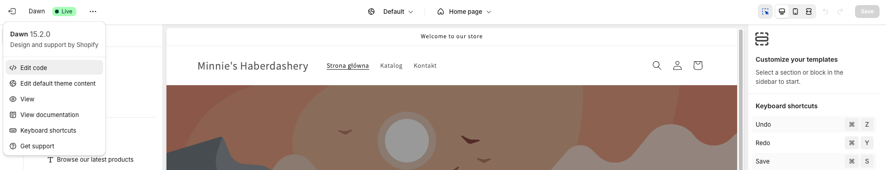

4. **Locate the `main-product.liquid` File:**

   In the file explorer on the left, we navigate to the **"Sections"** folder and find the **`main-product.liquid`**
   file.

5. **Add Custom JavaScript Code:**

   At the end of the **`main-product.liquid`** file, we add custom JavaScript code. This code extracts the `duid` value
   from the cookie, uses the Shopify Storefront API to fetch recommendations from the metaobject, and renders them in
   the **`recommendations-section`** HTML div. It refreshes the recommendations every second. You can find the code in
   [our Github repository](https://github.com/TouK/recommendations-showcase/blob/master/recommendations-scenario/snippets/shipify-theme-customizations/fetch-recommendations.js).

   _Note:_ Remember to replace `{YOUR-SHOP-ADDRESS}` with your actual store address and
   `{USE-nussknacker_fetch_recommendations-HERE}` with the token generated in the previous section.

6. **Add the Recommendations HTML Div:**

   We search for the text **`product-media-modal`** within the **`main-product.liquid`** file. Below that section, we
   add the HTML div where the recommendations will be rendered. We click **"Save"** to save our changes. You can find
   the code in
   [our Github repository](https://github.com/TouK/recommendations-showcase/blob/master/recommendations-scenario/snippets/shipify-theme-customizations/fetch-recommendations.html).

   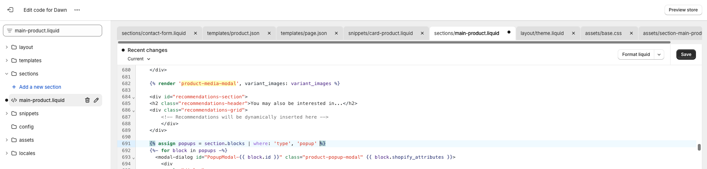

7. **Add Custom CSS Styles:**

   Next, we need to style the recommendations section. We locate the **`base.css`** file in the **"Assets"** folder. At
   the end of the **`base.css`** file, we add custom CSS code. We click **"Save"** to apply the changes. You can find
   the code in
   [our Github repository](https://github.com/TouK/recommendations-showcase/blob/master/recommendations-scenario/snippets/shipify-theme-customizations/fetch-recommendations.css).

8. **Save and Test:**

   With all the changes saved, we navigate to our Shopify store to test the recommendations feature.

**Testing the Implementation**

We visit our Shopify store and browse several products. It might take about **20 seconds** before the first
recommendations appear. While Nussknacker processes events almost instantly, Shopify's metastore refresh can introduce
some delay. This is important to keep in mind when testing.

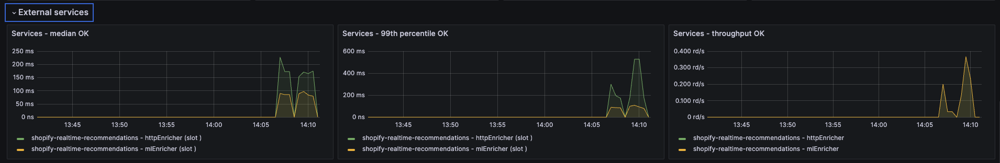

</details>
</br>


## Benefits of an Integrated Streaming Solution

Nussknacker empowers businesses to enhance e-commerce with real-time data processing and machine learning. By
integrating easily with tools like Snowplow and MLflow, it offers a seamless way to handle complex data streams and
deliver actionable insights.

**Seamless Integration with Clickstream Data**

Nussknacker captures and processes clickstream data from Snowplow, simplifying data collection and enabling businesses
to focus on insights instead of infrastructure.

**Real-Time Machine Learning**

By allowing the integration of pre-trained models from platforms like Databricks, Nussknacker makes it simple to
incorporate externally trained and managed models, enabling instant predictions and real-time personalization.
**Flexible and Intuitive**

Robust tools for data manipulation and a low-code interface allow businesses to adapt scenarios quickly, focusing on
strategy rather than technical details.

**Real-Time Recommendations**

Nussknacker enables instant, personalized recommendations, improving customer engagement and driving conversions.

## Conclusion: Transforming E-commerce with Real-Time Streaming and ML

Real-time data processing and machine learning are now essential for e-commerce success. Nussknacker simplifies this
integration, enabling businesses to:

- **Capture Insights Seamlessly:** Easily process user interactions using Snowplow.
- **Deliver Instant Predictions:** Use real-time ML for personalization without complex infrastructure.
- **Adapt Quickly:** Modify and scale scenarios to meet business needs.

With Nussknacker, businesses can act on data instantly, reduce development complexity, and enhance customer experiences.
It provides a powerful foundation for integrating real-time streaming and machine learning into modern e-commerce
platforms.

---

_Thank you for reading! We hope this inspires you to explore Nussknacker for your real-time data processing and machine
learning needs. Feel free to reach out with questions or for support._
